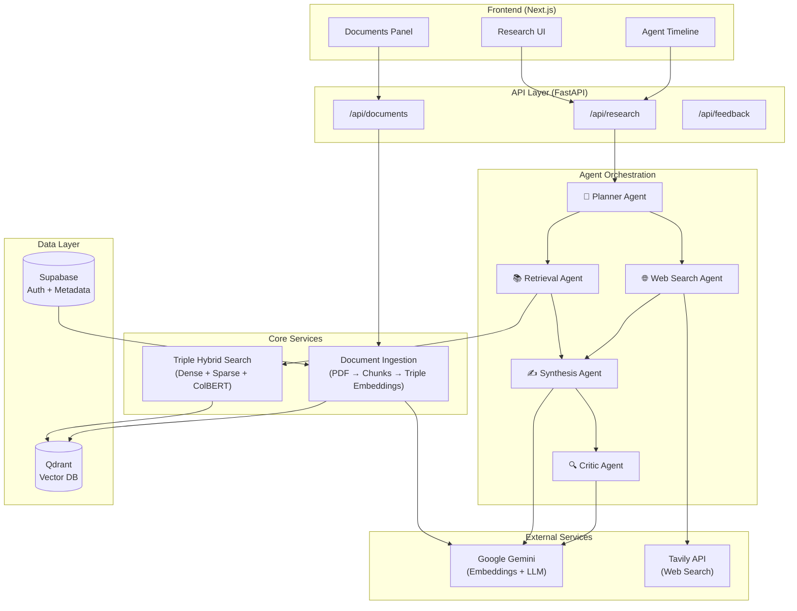

# Revera - Multi-Agent Research Tool

A research system combining **Triple Hybrid RAG** (Dense + Sparse + Late Interaction), live web search, and multi-agent orchestration.

## Architecture



## Tech Stack

| Layer | Technology |
|-------|------------|
| Frontend | Next.js 16, TypeScript, Tailwind CSS, shadcn/ui |
| Backend | FastAPI, Python 3.12, uv |
| Database | Supabase (Postgres for metadata/auth) |
| Vector DB | **Qdrant** (Triple Hybrid: Dense + Sparse + ColBERT) |
| AI | Google Gemini (gemini-embedding-001, gemini-3-flash-preview) |
| Local Models | FastEmbed (ColBERT, BM25) |
| Search | Tavily API |

## Triple Hybrid Search

Revera uses a state-of-the-art **Triple Hybrid** retrieval architecture:

| Vector Type | Model | Purpose |
|-------------|-------|---------|
| **Dense** | Gemini (3072d) | Semantic understanding |
| **Sparse** | BM25 | Keyword matching |
| **Late Interaction** | ColBERT (128d) | Precise contextual alignment |

All three vectors are stored in Qdrant and combined using prefetch + re-ranking for optimal retrieval.

## Project Structure

```
revera/
├── frontend/              # Next.js application
│   ├── app/               # App router pages
│   ├── components/        # UI components
│   └── lib/               # API client
├── backend/               # FastAPI application
│   └── app/
│       ├── agents/        # Multi-agent system
│       ├── api/           # REST endpoints
│       ├── core/          # Qdrant + Supabase clients
│       ├── services/      # Ingestion, Search
│       └── llm/           # Gemini client
└── supabase/
    └── migrations/        # Database schema
```

## Getting Started

### Prerequisites

- Node.js 20+ & pnpm
- Python 3.12+ & uv
- Supabase account
- Qdrant Cloud account (or local Docker)
- Google Gemini API key

### Setup

```bash
# Backend
cd backend
cp example.env .env  # Add your API keys
uv sync
uv run main.py

# Frontend
cd frontend
cp example.env .env.local
pnpm install
pnpm dev
```

### Environment Variables

**Backend** (`.env`):
```
DEBUG=false
SUPABASE_URL=https://your-project.supabase.co
SUPABASE_ANON_KEY=your-anon-key
SUPABASE_SERVICE_ROLE_KEY=your-service-role-key
GEMINI_API_KEY=your-gemini-key
TAVILY_API_KEY=your-tavily-key
QDRANT_URL=https://your-cluster.qdrant.tech
QDRANT_API_KEY=your-qdrant-key
```

**Frontend** (`.env.local`):
```
NEXT_PUBLIC_API_URL=http://localhost:8000
NEXT_PUBLIC_SUPABASE_URL=https://your-project.supabase.co
NEXT_PUBLIC_SUPABASE_ANON_KEY=your-anon-key
```

### Authentication

Google OAuth is the only sign-in method. To enable:
1. Go to Supabase Dashboard → Authentication → Providers → Google
2. Add your Google OAuth credentials
3. Add authorized redirect URLs:
   - Development: `http://localhost:3000/auth/callback`
   - Production: `https://your-domain.com/auth/callback`
4. Ensure the Supabase redirect URL is set to: `https://your-project.supabase.co/auth/v1/callback`

## API Endpoints

| Method | Endpoint | Description |
|--------|----------|-------------|
| POST | `/api/research/query` | Execute research query |
| GET | `/api/research/{id}/timeline` | Get agent execution timeline |
| POST | `/api/documents/upload` | Upload PDF document |
| GET | `/api/documents/` | List documents |
| DELETE | `/api/documents/{id}` | Delete document |
| POST | `/api/feedback/` | Submit feedback |

