# Revera - Multi-Agent Research Tool

A research system combining Hybrid RAG (dense + sparse retrieval), live web search, and multi-agent orchestration.

## Architecture

```mermaid
flowchart TB
    subgraph Frontend["Frontend (Next.js)"]
        UI[Research UI]
        Timeline[Agent Timeline]
        DocPanel[Documents Panel]
    end

    subgraph API["API Layer (FastAPI)"]
        Research["/api/research"]
        Documents["/api/documents"]
        Feedback["/api/feedback"]
    end

    subgraph Orchestrator["Agent Orchestration"]
        Planner["🎯 Planner Agent"]
        Retrieval["📚 Retrieval Agent"]
        WebSearch["🌐 Web Search Agent"]
        Synthesis["✍️ Synthesis Agent"]
        Critic["🔍 Critic Agent"]
    end

    subgraph Services["Core Services"]
        Ingestion["Document Ingestion<br/>(PDF → Chunks → Embeddings)"]
        HybridSearch["Hybrid Search<br/>(Dense + Sparse + RRF)"]
    end

    subgraph External["External Services"]
        Gemini["Google Gemini<br/>(Embeddings + LLM)"]
        Tavily["Tavily API<br/>(Web Search)"]
    end

    subgraph Data["Data Layer (Supabase)"]
        PG[(PostgreSQL)]
        Vector[(pgvector)]
        Storage[(File Storage)]
    end

    UI --> Research
    DocPanel --> Documents
    Timeline --> Research
    
    Research --> Planner
    Documents --> Ingestion
    
    Planner --> Retrieval
    Planner --> WebSearch
    Retrieval --> HybridSearch
    WebSearch --> Tavily
    Retrieval --> Synthesis
    WebSearch --> Synthesis
    Synthesis --> Critic
    
    HybridSearch --> Vector
    HybridSearch --> PG
    Ingestion --> Gemini
    Ingestion --> Vector
    Synthesis --> Gemini
    Critic --> Gemini
    
    Storage --> Ingestion
```



## Tech Stack

| Layer | Technology |
|-------|------------|
| Frontend | Next.js 16, TypeScript, Tailwind CSS, shadcn/ui |
| Backend | FastAPI, Python 3.12, uv |
| Database | Supabase (Postgres + pgvector) |
| AI | Google Gemini (text-embedding-004, gemini-1.5-pro/flash) |
| Search | Tavily API (optional) |

## Project Structure

```
revera/
├── frontend/              # Next.js application
│   ├── app/               # App router pages
│   ├── components/        # UI components
│   └── lib/               # API client
├── backend/               # FastAPI application
│   └── app/
│       ├── agents/        # Multi-agent system
│       ├── api/           # REST endpoints
│       ├── services/      # Ingestion, Search
│       └── llm/           # Gemini client
└── supabase/
    └── migrations/        # Database schema
```

## Getting Started

### Prerequisites

- Node.js 20+ & pnpm
- Python 3.12+ & uv
- Supabase account
- Google Gemini API key

### Setup

```bash
# Backend
cd backend
cp .env.example .env  # Add your API keys
uv sync
uv run uvicorn app.main:app --reload

# Frontend
cd frontend
cp .env.example .env.local
pnpm install
pnpm dev
```

### Environment Variables

**Backend** (`.env`):
```
SUPABASE_URL=your-project.supabase.co
SUPABASE_ANON_KEY=your-anon-key
SUPABASE_SERVICE_ROLE_KEY=your-service-role-key
GEMINI_API_KEY=your-gemini-key
WEB_SEARCH_API_KEY=your-tavily-key  # Optional
```

**Frontend** (`.env.local`):
```
NEXT_PUBLIC_API_URL=http://localhost:8000
NEXT_PUBLIC_SUPABASE_URL=your-project.supabase.co
NEXT_PUBLIC_SUPABASE_ANON_KEY=your-anon-key
```

## API Endpoints

| Method | Endpoint | Description |
|--------|----------|-------------|
| POST | `/api/research/query` | Execute research query |
| GET | `/api/research/{id}/timeline` | Get agent execution timeline |
| POST | `/api/documents/upload` | Upload PDF document |
| GET | `/api/documents/` | List documents |
| DELETE | `/api/documents/{id}` | Delete document |
| POST | `/api/feedback/` | Submit feedback |

## License

MIT

