# Revera - Multi-Agent Research Tool

A research system combining **Triple Hybrid RAG** (Dense + Sparse + ColBERT), live web search, and multi-agent orchestration powered by **LangGraph**. Leverages **Gemini 3** with native thinking mode, **Reciprocal Rank Fusion (RRF)**, and parallel execution for fast, accurate research answers with transparent reasoning.

## Architecture

```mermaid
flowchart TB
    subgraph Client["Frontend (Next.js)"]
        UI["Chat UI + Streamdown"] --> Store["Zustand Store"]
    end
    
    subgraph Server["Backend (FastAPI)"]
        ChatsAPI["/api/chats/*"]
        DocsAPI["/api/documents/*"]
    end
    
    subgraph ResearchFlow["LangGraph Research Workflow"]
        direction LR
        Plan["🎯 Plan"] --> Retrieve["📚 RAG"]
        Plan --> Web["🌐 Web"]
        Plan --> ImgGen["🎨 Image Gen"]
        Retrieve --> Synth["✍️ Synthesize"]
        Web --> Synth
        ImgGen --> Synth
        Synth --> Critic["🔍 Critic"]
        Critic -->|refine| Synth
    end
    
    subgraph External["External APIs"]
        Gemini["Gemini API<br/>(LLM + Vision + Image Gen)"]
        Tavily["Tavily API<br/>(Web Search)"]
    end
    
    subgraph Storage["Data Layer"]
        Qdrant[("Qdrant<br/>Vectors")]
        Supabase[("Supabase<br/>Auth + DB")]
        SupaStorage[("Supabase<br/>Storage")]
        Memory[("Agent<br/>Memory")]
    end
    
    Client <-.->|SSE Stream| Server
    Server --> ResearchFlow
    
    ResearchFlow --> Gemini
    ImgGen --> Gemini
    Web --> Tavily
    Retrieve --> Qdrant
    Synth --> SupaStorage
    ImgGen --> SupaStorage
    ResearchFlow --> Memory
    DocsAPI --> Supabase
```



## Key Features

- **🔍 Triple Hybrid RAG**: Combines Dense (semantic), Sparse (keyword), and ColBERT (late interaction) retrieval with **Reciprocal Rank Fusion (RRF)** for superior accuracy
- **🧠 Thinking Mode**: Gemini 3's native thinking capability streams reasoning tokens in real-time — displayed in collapsible UI with execution timeline
- **🖼️ Image Context**: Upload images alongside PDFs — Gemini 3 Vision analyzes images for multimodal research answers
- **🎨 Image Generation**: Planner autonomously decides when to generate images — runs as a first-class LangGraph node in parallel with retrieval and web search, with generated images tracked per chat for proper cleanup
- **🤖 Multi-Agent Orchestration**: LangGraph workflow with planning, retrieval, web search, image generation, synthesis, and critic agents — all streamed via `astream_events`
- **🌐 Live Web Search**: Tavily API with self-skip logic — runs in parallel with retrieval, skips automatically when not needed
- **♻️ Iterative Refinement**: Critic agent verifies answers and triggers re-synthesis for low-confidence results (resilient to API failures)
- **⚡ Parallel Fan-Out**: Retrieval + Web Search + Image Generation execute concurrently after planning (~3x speedup)
- **📊 Real-Time Streaming**: SSE-only architecture for live agent progress, answer/thought chunks, and generated image markdown streamed via LangGraph custom events
- **📚 Chat-Scoped Documents**: Upload, index, and search PDFs and images — automatically scoped to the active chat
- **💬 Chat Management**: Multi-turn conversations with comprehensive cascade cleanup on deletion (DB, storage, vectors, memory)
- **🔐 Secure Authentication**: Google OAuth via Supabase with row-level security
- **⚛️ Modern State Management**: Zustand store with custom hooks (`useStreamingChat`, `useUIState`) for clean, testable code
- **📝 Streaming Markdown**: Vercel's Streamdown library with syntax highlighting, KaTeX math, citation formatting, and safe paragraph rendering for images

## Tech Stack

| Component | Technology |
|-----------|-----------|
| **Frontend** | Next.js 16, React 19, TypeScript, Tailwind CSS v4, shadcn/ui |
| **Markdown** | Streamdown (streaming-optimized), @streamdown/code, @streamdown/math (KaTeX) |
| **State Management** | Zustand (chat store), Custom hooks (streaming, UI) |
| **Backend** | FastAPI, Python 3.12+, asyncio |
| **Orchestration** | LangGraph (state-based agent workflow with parallel fan-out) |
| **Vector Database** | Qdrant (Triple Hybrid: Dense + Sparse + ColBERT) |
| **Agent Memory** | LangGraph InMemoryStore (episodic/semantic memory) |
| **Embeddings** | Gemini 3 (3072d dense), FastEmbed (BM25, ColBERT) |
| **LLM** | Gemini 3 Flash Preview (with native thinking mode) |
| **Image Generation** | Gemini 2.5 Flash Image (text-to-image, planner-driven) |
| **Web Search** | Tavily API |
| **Auth & Metadata** | Supabase (PostgreSQL, JWT) |
| **Storage** | Supabase Storage (PDFs, images, generated images) |
| **UI Components** | shadcn/ui, Radix UI, lucide-react icons |

### Backend Setup

```bash
# Navigate to backend directory
cd backend

# Copy environment template and add your API keys
cp example.env .env
# Install dependencies
uv sync

# Run the server (starts on http://localhost:8000)
uv run main.py
```

### Frontend Setup

```bash
# Navigate to frontend directory
cd frontend

# Copy environment template
cp example.env .env.local

# Install dependencies
pnpm install
# Start development server (runs on http://localhost:3000)
pnpm dev
```

### Environment Variables

**Backend (.env)**:
```
# Application
DEBUG=false

# Supabase
SUPABASE_URL=https://your-project.supabase.co
SUPABASE_ANON_KEY=your-anon-key
SUPABASE_SERVICE_ROLE_KEY=your-service-role-key

# Google Gemini
GEMINI_API_KEY=your-gemini-api-key

# Tavily 
TAVILY_API_KEY=your-tavily-api-key

# Qdrant
QDRANT_URL=https://your-cluster.qdrant.tech
QDRANT_API_KEY=your-qdrant-api-key
QDRANT_UPSERT_BATCH_SIZE=50

```

**Frontend (.env.local)**:
```
# Backend API
NEXT_PUBLIC_API_URL=http://localhost:8000

# Supabase
NEXT_PUBLIC_SUPABASE_URL=your-project-url.supabase.co
NEXT_PUBLIC_SUPABASE_ANON_KEY=your-anon-key

```

## API Endpoints

### Research Endpoints

| Method | Endpoint | Description |
|--------|----------|-------------|
| GET | `/api/research/{id}/timeline` | Get agent execution timeline |

### Session History

| Method | Endpoint | Description |
|--------|----------|-------------|
| GET | `/api/research/history/` | List all research sessions |
| GET | `/api/research/history/{id}` | Get session details |
| DELETE | `/api/research/history/{id}` | Delete a session |

### Document Management

| Method | Endpoint | Description |
|--------|----------|-------------|
| POST | `/api/documents/upload?chat_id={id}` | Upload PDF or image (PNG/JPG/WebP/GIF) - auto-creates chat if no `chat_id` |
| GET | `/api/documents/?chat_id={id}` | List documents (optional chat filter) |
| DELETE | `/api/documents/{id}` | Delete document and embeddings |

### Chat Management

| Method | Endpoint | Description |
|--------|----------|-------------|
| GET | `/api/chats/` | List all chats for user |
| POST | `/api/chats/` | Create new chat |
| GET | `/api/chats/{id}` | Get chat details |
| PUT | `/api/chats/{id}` | Update chat (e.g., title) |
| DELETE | `/api/chats/{id}` | **Comprehensive deletion** (cascade across DB, Qdrant, storage, memory) |
| GET | `/api/chats/{id}/messages` | Get all messages in chat |
| GET | `/api/chats/{id}/messages/{msg_id}/verification` | Poll verification status |
| POST | `/api/chats/{id}/query/stream` | Send query with SSE streaming (answer, thoughts, sources) |
| GET | `/api/chats/{id}/memory` | Get agent memory context |
| GET | `/api/chats/{id}/memory/{agent}` | Get memory for specific agent |

## Request Payload Structure

### Chat Query Request

**Endpoint:** `POST /api/chats/{chat_id}/query/stream`

```json
{
  "query": "Your research question",
  "use_web": true,
  "document_ids": ["id1", "id2"]
}
```

**Parameters:**
- `query` (string, required): The research question (max 2000 characters). The planner will autonomously decide whether to generate an image based on the query intent.
- `use_web` (boolean, optional): Enable/disable live web search (default: `true`)
- `document_ids` (array of strings, optional): Restrict search to specific uploaded documents; if omitted, all chat documents are used

**Streaming Event Types (SSE):**
- `agent_status`: Agent node start/completion (planning, retrieval, web_search, image_gen, synthesis, critic)
- `answer_chunk`: Streamed answer text and generated image markdown
- `thought_chunk`: Streamed thinking/reasoning text
- `sources`: Source list when available
- `title_updated`: Auto-generated chat title
- `complete`: Final payload with session metadata + agent timeline
- `error`: Error payload


