# Revera - Multi-Agent Research Tool

A research system combining **Triple Hybrid RAG** (Dense + Sparse + Late Interaction), live web search, and multi-agent orchestration powered by **LangGraph**.

## Key Features

- **🔍 Triple Hybrid RAG**: Dense (Gemini 3072d) + Sparse (BM25) + Late Interaction (ColBERT) retrieval
- **🤖 LangGraph Orchestration**: State-based agent workflow with conditional routing and feedback loops
- **🌐 Web Search Integration**: Live results via Tavily API when local knowledge isn't sufficient
- **♻️ Iterative Refinement**: Critic agent verifies answers and triggers re-synthesis if confidence is low
- **📊 Real-time Streaming**: Watch agent progress live as each node completes
- **📚 PDF Document Ingestion**: Upload and index documents with triple embeddings
- **🔐 Secure Auth**: Google OAuth via Supabase with row-level security

## Architecture

```mermaid
flowchart TB
    subgraph Frontend["Frontend (Next.js)"]
        UI[Research UI]
        Timeline[Agent Timeline]
        DocPanel[Documents Panel]
    end

    subgraph API["API Layer (FastAPI)"]
        Research["/api/research"]
        Documents["/api/documents"]
    end

    subgraph LangGraph["LangGraph Workflow"]
        Planner["🎯 Planning Node<br/>(Analyze & Plan)"]
        Retrieval["📚 Retrieval Node<br/>(Hybrid RAG)"]
        WebSearch["🌐 Web Search Node<br/>(Tavily)"]
        Synthesis["✍️ Synthesis Node<br/>(Generate Answer)"]
        Critic["🔍 Critic Node<br/>(Verify Quality)"]
        
        Planner --> Retrieval
        Retrieval -->|conditional| WebSearch
        Retrieval -->|skip if not needed| Synthesis
        WebSearch --> Synthesis
        Synthesis --> Critic
        Critic -->|low confidence| Synthesis
        Critic -->|verified| End[END]
    end

    subgraph Services["Core Services"]
        Ingestion["Document Ingestion<br/>(PDF → Chunks → Triple Embeddings)"]
        HybridSearch["Triple Hybrid Search<br/>(Dense + Sparse + ColBERT)"]
    end

    subgraph External["External Services"]
        Gemini["Google Gemini<br/>(Embeddings + LLM)"]
        Tavily["Tavily API<br/>(Web Search)"]
    end

    subgraph Data["Data Layer"]
        Supabase[(Supabase<br/>Auth + Metadata + Sessions)]
        Qdrant[(Qdrant<br/>Vector DB)]
    end

    UI --> Research
    DocPanel --> Documents
    Timeline --> Research
    
    Research --> Planner
    Documents --> Ingestion
    
    Retrieval --> HybridSearch
    WebSearch --> Tavily
    
    HybridSearch --> Qdrant
    Ingestion --> Gemini
    Ingestion --> Qdrant
    Synthesis --> Gemini
    Critic --> Gemini
    
    Supabase --> Ingestion
    Research --> Supabase
```



## Tech Stack

| Layer | Technology |
|-------|------------|
| Frontend | Next.js 16, TypeScript, Tailwind CSS, shadcn/ui |
| Backend | FastAPI, Python 3.12, uv |
| Orchestration | **LangGraph 1.0** (State-based agent workflow with conditional routing) |
| Database | Supabase (Postgres for metadata/auth) |
| Vector DB | **Qdrant** (Triple Hybrid: Dense + Sparse + ColBERT) |
| AI | Google Gemini (gemini-embedding-001, gemini-3-flash-preview) |
| Local Models | FastEmbed (ColBERT, BM25) |
| Search | Tavily API |

## Triple Hybrid Search

Revera uses a state-of-the-art **Triple Hybrid** retrieval architecture:

| Vector Type | Model | Purpose |
|-------------|-------|---------|
| **Dense** | Gemini (3072d) | Semantic understanding |
| **Sparse** | BM25 | Keyword matching |
| **Late Interaction** | ColBERT (128d) | Precise contextual alignment |

All three vectors are stored in Qdrant and combined using prefetch + re-ranking for optimal retrieval.

## Agent Orchestration

Revera uses **LangGraph** for sophisticated multi-agent coordination with a state-based workflow architecture:

### Key Features

- **Conditional Routing**: Dynamic decision-making at runtime
  - Web search runs only if needed based on plan or user preference
  - Critic determines if answer refinement is required
  
- **Parallel Execution**: Infrastructure ready for concurrent agent execution
  - Retrieval and web search can run simultaneously
  - Reduces overall query latency
  
- **Feedback Loops**: Iterative refinement for higher quality answers
  - Critic evaluates answer confidence and verification status
  - Low-confidence answers trigger re-synthesis (up to 2 iterations)
  
- **Streaming Support**: Real-time updates via `research_stream()`
  - Frontend receives progress as each node completes
  - Better user experience with live agent status
  
- **State Management**: Shared `ResearchState` across all nodes
  - Replaces manual context dictionary passing
  - Timeline automatically tracked via `Annotated[list, add]`
  - Better observability and debugging

### Workflow Structure

```
START
  ↓
Planning (analyze query, create execution plan)
  ↓
Retrieval (hybrid RAG: Dense + Sparse + ColBERT)
  ↓
[Web Search?] ← conditional based on plan/preferences
  ↓ (if yes)
Web Search (Tavily API)
  ↓
Synthesis (combine all sources into grounded answer)
  ↓
Critic (verify answer quality & source alignment)
  ↓
[Refine?] ← conditional based on confidence
  ↓ (if yes, loop back to Synthesis)
END
```

### Implementation

The graph is built using three core files:

- **`graph_state.py`**: Defines `ResearchState` TypedDict with all workflow data
- **`graph_nodes.py`**: Async node functions wrapping each agent + conditional edge logic
- **`graph_builder.py`**: Builds and compiles the StateGraph with edges and routing

## Getting Started

### Prerequisites

- Node.js 20+ & pnpm
- Python 3.12+ & uv
- Supabase account
- Qdrant Cloud account (or local Docker)
- Google Gemini API key

### Setup

```bash
# Backend
cd backend
cp example.env .env  # Add your API keys
uv sync
uv run main.py

# Frontend
cd frontend
cp example.env .env.local
pnpm install
pnpm dev
```

### Environment Variables

**Backend** (`.env`):
```
DEBUG=false
SUPABASE_URL=https://your-project.supabase.co
SUPABASE_ANON_KEY=your-anon-key
SUPABASE_SERVICE_ROLE_KEY=your-service-role-key
GEMINI_API_KEY=your-gemini-key
TAVILY_API_KEY=your-tavily-key
QDRANT_URL=https://your-cluster.qdrant.tech
QDRANT_API_KEY=your-qdrant-key
QDRANT_UPSERT_BATCH_SIZE=50
```

**Frontend** (`.env.local`):
```
NEXT_PUBLIC_API_URL=http://localhost:8000
NEXT_PUBLIC_SUPABASE_URL=https://your-project.supabase.co
NEXT_PUBLIC_SUPABASE_ANON_KEY=your-anon-key
```

### Authentication

Google OAuth is the only sign-in method. To enable:
1. Go to Supabase Dashboard → Authentication → Providers → Google
2. Add your Google OAuth credentials
3. Add authorized redirect URLs:
   - Development: `http://localhost:3000/auth/callback`
   - Production: `https://your-domain.com/auth/callback`
4. Ensure the Supabase redirect URL is set to: `https://your-project.supabase.co/auth/v1/callback`

## API Endpoints

| Method | Endpoint | Description |
|--------|----------|-------------|
| POST | `/api/research/query` | Execute research query (supports streaming) |
| GET | `/api/research/{id}/timeline` | Get agent execution timeline |
| GET | `/api/research/history/` | List all research sessions |
| GET | `/api/research/history/{id}` | Get session details |
| DELETE | `/api/research/history/{id}` | Delete a session |
| POST | `/api/documents/upload` | Upload PDF document |
| GET | `/api/documents/` | List documents |
| DELETE | `/api/documents/{id}` | Delete document |

### Research Query Parameters

```json
{
  "query": "Your research question",
  "use_web": true,              // Enable/disable web search
  "document_ids": ["id1", "id2"], // Optional: search specific docs
  "max_iterations": 2           // Max refinement loops (default: 2)
}
```

**Response includes:**
- `answer`: Generated response
- `sources`: Combined internal + web sources with scores
- `verification`: Critic's confidence assessment
- `agent_timeline`: Execution log with latencies
- `confidence`: Overall quality rating (high/medium/low)
- `total_latency_ms`: End-to-end processing time
- `iterations`: Number of refinement loops executed
